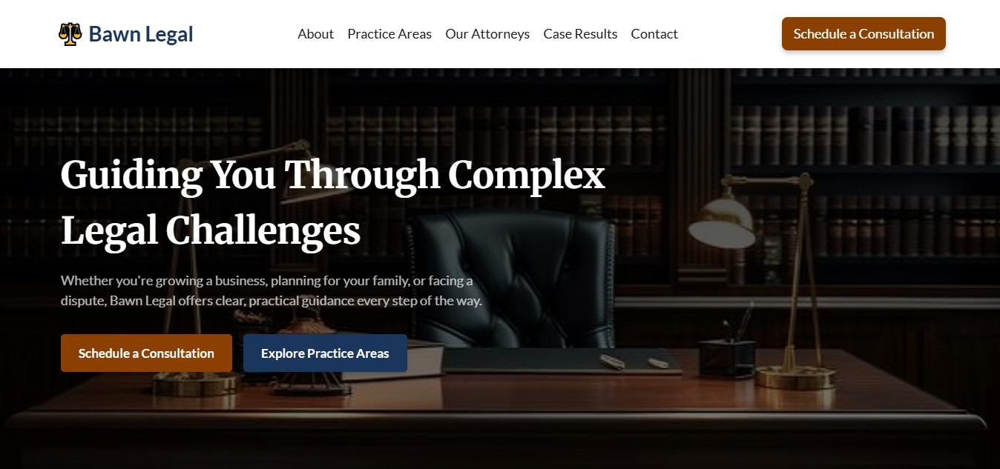
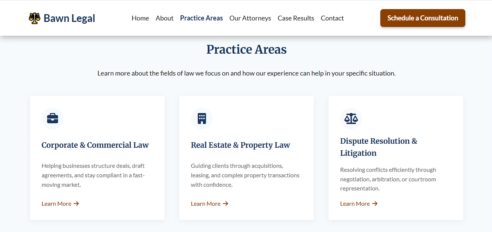

# Bawn Legal - Law Firm Website

**Bawn Legal** is a multi-page concept website for a law firm built to highlight core legal services and expertise, inspiring client confidence. Designed and developed with HTML, CSS, and JavaScript, the site focuses on clear structure and accessible layouts, giving potential clients an easy way to understand services and reach out for consultation.

## 📸 Screenshots:

### Bawn Legal website Hero section

### Bawn Legal website Practice areas section

## 🌐 Live Demo:

[View the live site](https://bawnlegal.vercel.app/)

## 📂 Pages

- Home  
- About  
- Practice Areas  
- Attorneys
- Case Results
- Legal Insights
- Contact 

## Features:

- Multi-page structure (Home, About, Practice Areas, Attorneys, Case Results, Legal Insights, Contact)
- Fully responsive and mobile-friendly layout
- Clear navigation and information hierarchy
- Contact form with real-time validation
- Smooth animations and transitions

## 🛠️ Technologies Used:

- **HTML5** - Structuring website content
- **CSS** - Custom styling with Flexbox/Grid, responsive design
- **JavaScript** - Interactivity: Accordion and dynamic content

## 💡 Purpose:

This project was built as part of my portfolio to demonstrate my ability to create a professional website for a service-based business.

## ⚠️ Note:

This project is a **concept portfolio piece** and **not open source**.  
Reproduction, redistribution, or commercial use of the design or code is not allowed.

## 👤 Author:

**Chijioke Nwabasili**
- Portfolio: [chijiokenwabasili.vercel.app](https://chijiokenwabasili.vercel.app)

