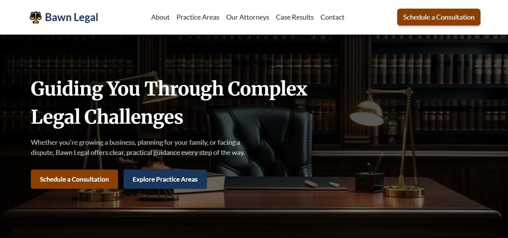
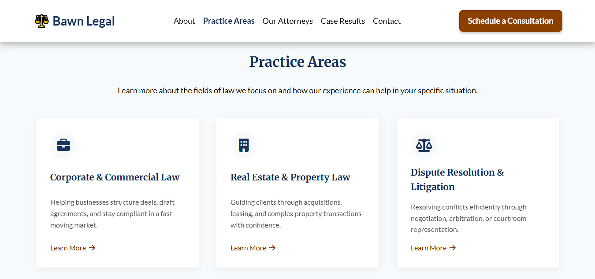

# Bawn Legal - Law Firm Website

**Bawn Legal** is a responsive, multi-page concept website for a law firm, designed to communicate professionalism, trust, and clarity. It showcases core legal services, builds credibility through a clean and structured layout, and guides visitors toward making inquiries.

## 🌐 Live Demo:

[View the live site](https://bawnlegal.vercel.app/)

## 📂 Pages

- Home  
- About  
- Practice Areas  
- Attorneys
- Case Results
- Legal Insights
- Contact 

## 📸 Screenshots:

### Bawn Legal website Hero section

### Bawn Legal website Practice areas section

## Features:

- Multi-page structure (Home, About, Practice Areas, Attorneys, Case Results, Legal Insights, Contact)
- Fully responsive and mobile-friendly layout
- Clear navigation and information hierarchy
- Contact form with real-time validation
- Smooth animations and transitions

## 🛠️ Technologies Used:

- **HTML5** - Structuring website content
- **CSS3** - Custom styling with Flexbox/Grid, responsive design
- **JavaScript** - Interactivity: Accordion and dynamic content

## 💡 Purpose:

This project was built as part of my portfolio to demonstrate my ability to create a professional website for a service-based business.

## ⚠️ Note:

This project is a **concept portfolio piece** and **not open source**.  
Reproduction, redistribution, or commercial use of the design or code is not allowed.

## 👤 Author:

**Chijioke Nwabasili**
- Portfolio: [chijiokenwabasili.vercel.app](https://chijiokenwabasili.vercel.app)
- LinkedIn: [Chijioke Nwabasili](https://linkedin.com/in/chijioke-nwabasili)

